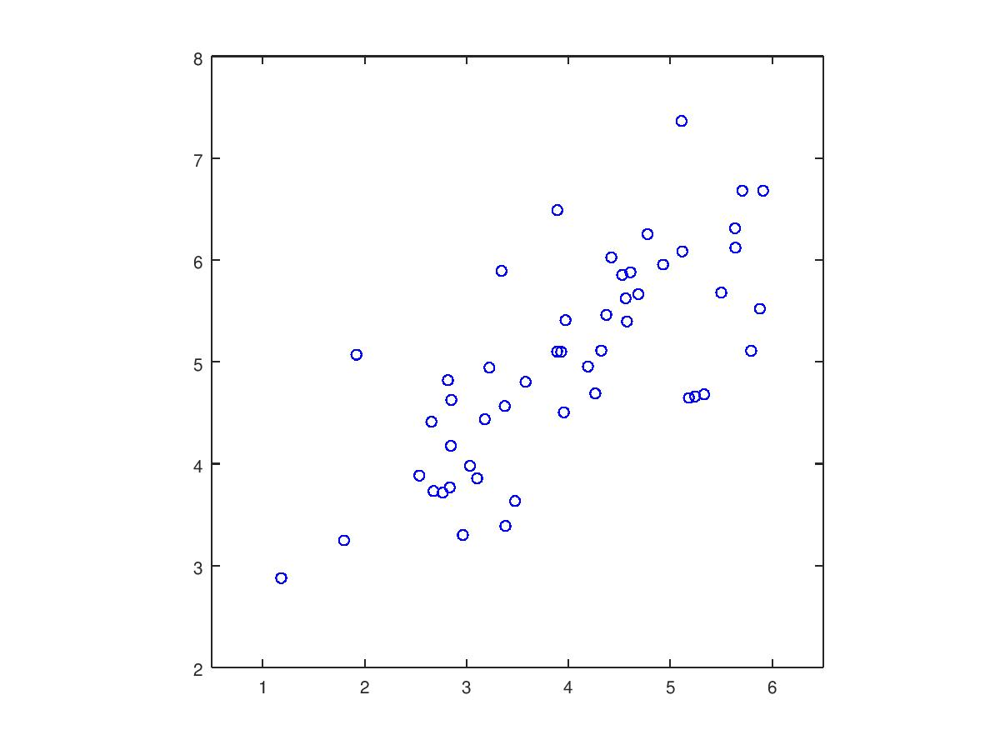
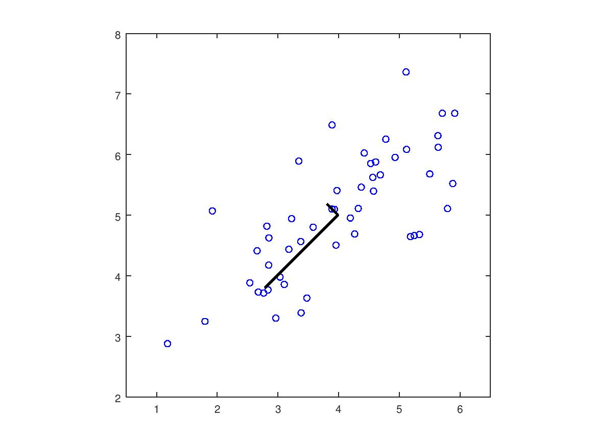

# dimensionality-reduction
We use principal component analysis (PCA) to perform dimensionality reduction.

## Table of Contents
* [Example Dataset](#example-dataset)
* [Implementing PCA](#implementing-pca)
* [To-Do List](#to\-do-list)

## Example Dataset
To understand how PCA works, we start first start with a 2D dataset which which has
one direction of large variation and one of smaller variation. The script file **tests/ExampleDataset.m**
will plot the training data 



We will visualize what happen when we use
PCA to reduce the data from 2D to 1D. In practice. we want
to reduce data from say 256 to 50 dimensions; however, using lower dimensional data makes it easier 
for us to visualize the algorithms.

## Implementing PCA
PCA consists of two computational steps: First, compute the covariance matrix of the data.
Then, you use Octave's SVD function to compute the eigenvectors *U<sub>1</sub>*,
*U<sub>2</sub>*,...,*U<sub>n</sub>*. These will correspond to the principal
components of variation in the data.
Before using PCA, it is important to first normalize the data by subtracting
the mean value of each feature from the dataset, and scaling each dimension so
that they are in the same range. We perform normalization using **src/featureNormalize.m**
After normalizing the data, we can run PCA to compute the principal components.
**src/pca.m** computes the principal components of the dataset, which first computes
the covariance matrix of the data, given by:

*M = 1/m(X<sup>T</sup>X)*

where *X* is the data matrix with examples in rows, and *m* is the number
of examples. Note that *M* is a *n x n* matrix.
After computing the covariance matrix, we run SVD to compute principal components.
In Octave, SVD runs from the following command: 
```Octave
[U, S, V] = svd(Sigma)
```
where *U* will contain the principal components and *S* will contain a diagonal matrix.



**tests/PCA.m** runs PCA on the example dataset and plot the corresponding principal components
(*see figure above*). This script also outputs the top principal component (eigenvectors)
found, and has an expected output of
```Octave
[-0.707,-0.707]
```
(It is possible that Octave may instead output of negative of this, since *U<sub>1</sub>*
and *-U<sub>1</sub>* are equally valid choices for the first principal component.)

## To-Do List
- [X] implement tests/ExampleDataset.m
- [X] create figure for Example Dataset
- [ ] implement PCA
  - [X] implement src/featureNormalize.m
  - [X] implement src/pca.m
  - [ ] implement tests/PCA.m
  - [X] create figure for PCA
